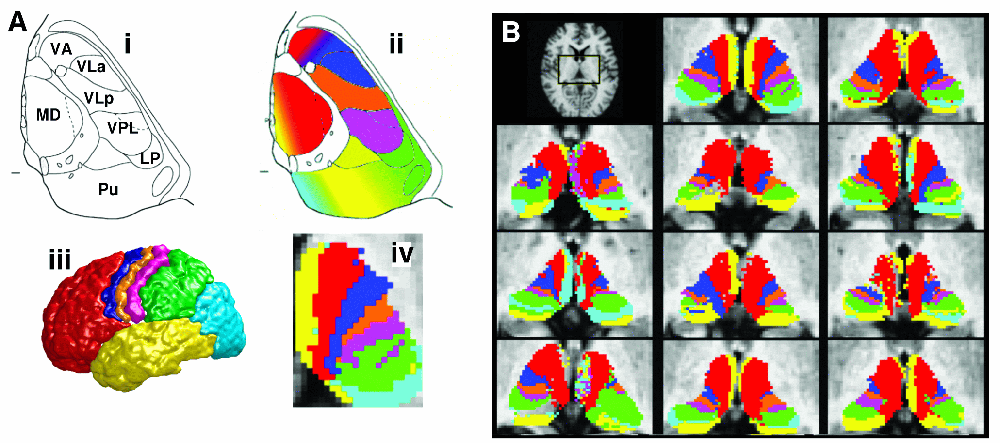

# delta-BIT
## What is delta-BIT
DELTA-BIT stands for Deep-learning Local TrActography for BraIn Targeting, it comes from the idea to make faster the [FSL](https://fsl.fmrib.ox.ac.uk/fsl/fslwiki) pipeline for [probabilistic tractography](https://fsl.fmrib.ox.ac.uk/fsl/fslwiki/FDT/UserGuide#PROBTRACKX_-_probabilistic_tracking_with_crossing_fibres). 

In brief, probabilistic tractographies are random walks which use DWI images to get structural connectivity information. After a diffusion model has been build up and a fiber Orientation Distribution Function (fODF) for each voxel has been evaluated, it is possible to run several sample streamlines by starting from some seed and then taking steps in random directions chosen according to the fODF. The result of the streamlines can be used to represent the structural connectivity of the seed voxels with certain ROIs in the brain, such as areas of the cortex. One of the applications of probabilistic tractography is the voxels by ROI connectivity [[1](#1)-[2](#2)-[3](#3)], which can be used for the *in-vivo* parcellation of the thalamus (look at the figures below) .




This type of analysis can be used for targeting purpuose, such as in tcMRgFUS treatment for essential tremor.

In delta-BIT we implemented Convolutional Neural Network (CNN) for the voxels by ROI connectivity fast estimation. In particular we considered the connectivity of the voxel of the thalamus with the below cortex areas:

- frontal cortex;
- occipital cortex;
- parietal cortex;
- postcentral gyrus;
- precentral gyrus;
- temporal cortex.

The idea was to train one U-NET for thalamus segmentation on T1 image, and 6 U-NETs which combine DTI images to predict the connectivity maps of the thalamus with the above cortex areas.

Our workflow involves the application of minimal preprocessing (DWI eddy current and movement correction and acpc registration on the standard template MNI152_1mm), prediction of the thalamus of the left hemisphere, combining the DTI images with thalamus, and finaly tractographies prediction.

The full pipeline takes approximately 3 minutes and 30 seconds to make predictions, which is a great result compared to at least 2 and a half hours required by FSL for a complete tractography analysis(starting from raw data).


### References
<a id="1">[1]</a> Behrens, T.E., Berg, H.J., Jbabdi, S., Rushworth, M.F., Woolrich, M.W., 2007. Probabilistic diffusion tractography with multiple fibre orientations: What can we gain? neuroimage 34, 144–155.
<a id="2">[2]</a> Behrens, T.E., Johansen-Berg, H., Woolrich, M., Smith, S., Wheeler-Kingshott, C., Boulby, P., Barker, G., Sillery, E., Sheehan, K., Ciccarelli, O., et al., 2003a. Non-invasive mapping of connections between human thalamus and cortex using diffusion imaging. Nature neuroscience 6, 750–757.
<a id="3">[3]</a> Behrens, T.E., Woolrich, M.W., Jenkinson, M., Johansen-Berg, H., Nunes, R.G., Clare, S., Matthews, P.M., Brady, J.M., Smith, S.M., 2003b. Characterization and propagation of uncertainty in diffusion-weighted mr imaging. Magnetic Resonance in Medicine: An Official Journal of the International Society for Magnetic
Resonance in Medicine 50, 1077–1088

## Get started

* [Requirements](#requirements)
* [Installation](#installation)
* [Usage](#usage)

### Requirements
delta-BIT has been developed on Linux (Ubuntu 22.04) and it has been tested on macOS and on Windows using [Windows Subsystem for Linux](https://learn.microsoft.com/en-us/windows/wsl/) (FSL recomendation for Windows user, https://fsl.fmrib.ox.ac.uk/fsl/fslwiki/FslInstallation/Windows). 

For a standard and easy installation we suggest you to satisfy the below requirements:
1) [FSL](https://fsl.fmrib.ox.ac.uk/fsl/fslwiki/) installation (required).*
2) nvidia drivers (for gpu users).
3) [conda](https://conda.io/projects/conda/en/latest/index.html#) installation (strongly recommend).

*FSL last versions (since 6.0.6) might have conflict with conda environments (not only with delta-BIT) for this reason we suggest to have a look at [fix FSL-conda conflict](./INSTALL.md#fix-fsl-conda-conflict) section before install it or delta-BIT.

### Installation
There is a [fast installation](INSTALL.md#fast-installation) section and a [step-by-step](INSTALL.md#step-by-step-installation) section in the [installation guide](INSTALL.md). If you are not a developer we recommend you to only follow the first one. In case you encounter any problems you can try following the section step by step to better understand the installation process and find a solution.


### Usage
delta-BIT can be run from terminal, all commands start with ```d-BIT_``` and all of them have a user manual that can be called by adding the -h flag to the end of the command.

At the moment delta-BIT has the following main pipeline:

* Preprocessing Pipeline
To see the usar manual of the preprocessing pipeline for testing click [here](./dBIT/test_pipeline/preprocessing/README.md).
* Testing Pipeline
To see the usar manual of the testing pipeline for testing click [here](./dBIT/test_pipeline/testing/README.md).

If you are not interested in the preprocessing processes you can directly predict tractographies using the command ```d-BIT_full_test_pipeline```, it will run the full and standard pipeline. By typing:
>d-BIT_full_test_pipeline -h

it will output
```
usage: d-BIT_full_test_pipeline [-h] -n NAME [-m {pretrained}] [--data_type DATA_TYPE] -dir DATASET_DIRECTORY
                                [--T1 T1] [--dwi DWI] [--bvecs BVECS] [--bvals BVALS] [--registration] [--tmp]
                                [--cortex_area CORTEX_AREA [CORTEX_AREA ...]] [-o OUTPUT_DIR]

With this script you can run the standard pipeline to predict probabilistic tractographies.The minimum requirement is
the dataset preparation in accordance with the dataset structure

optional arguments:
  -h, --help            show this help message and exit
  -n NAME, --name NAME  Project's name (default: None)
  -m {pretrained}, --models {pretrained}
                        Insert here the name of the models you want to use (default: pretrained)
  --data_type DATA_TYPE
                        Insert here the extention of the disired output data: possibility nii, nii.gz, mgz (default:
                        nii.gz)
  -dir DATASET_DIRECTORY, --dataset_directory DATASET_DIRECTORY
                        indicate here your main folder which cointains your dataset (default: None)
  --T1 T1               file name of the T1 image (default: T1.nii.gz)
  --dwi DWI             file name of the DWI image (default: DWI.nii.gz)
  --bvecs BVECS         file name of the bvecs file (default: DWI.bvec)
  --bvals BVALS         file name of the bvals file (default: DWI.bval)
  --registration        Inser if you data have already been registered on a standard template (default: False)
  --tmp                 Insert this flag if you want to keep temporary files (default: False)
  --cortex_area CORTEX_AREA [CORTEX_AREA ...]
                        Insert here the cortex area you want to predict choose between ['pretrained', 'all'] (default:
                        ['all'])
  -o OUTPUT_DIR, --output_dir OUTPUT_DIR
                        output_directory (default: $HOME/project_name)
```
As you can see, you need to specify only few flags and for almost all of them you have a default version, in this way you can make your own dataset (in accordance with [the data structure](./dBIT/test_pipeline/preprocessing/README.md#dataset-structure)) using the default names. The flag --name, the project name, is used to map old and processed data, in this way for all command you run you will need just the project name.


